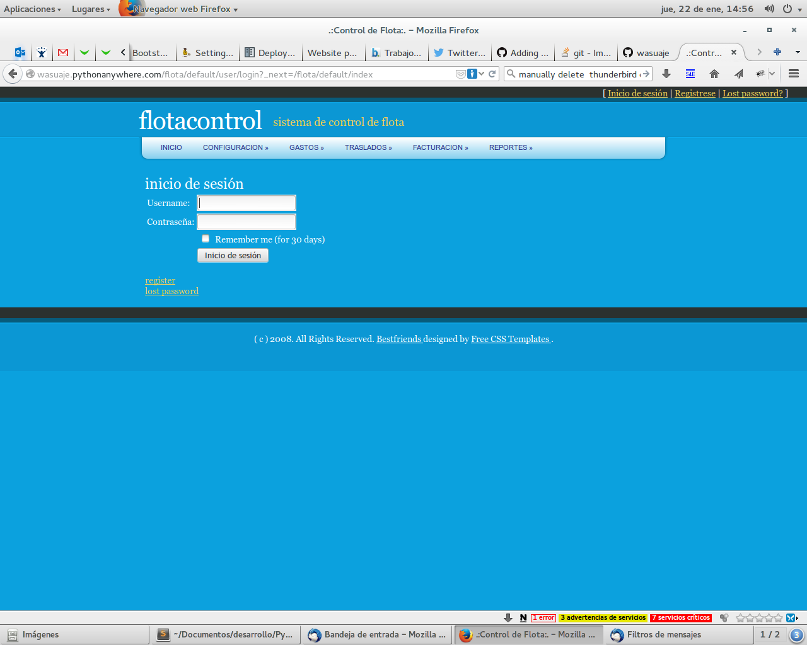
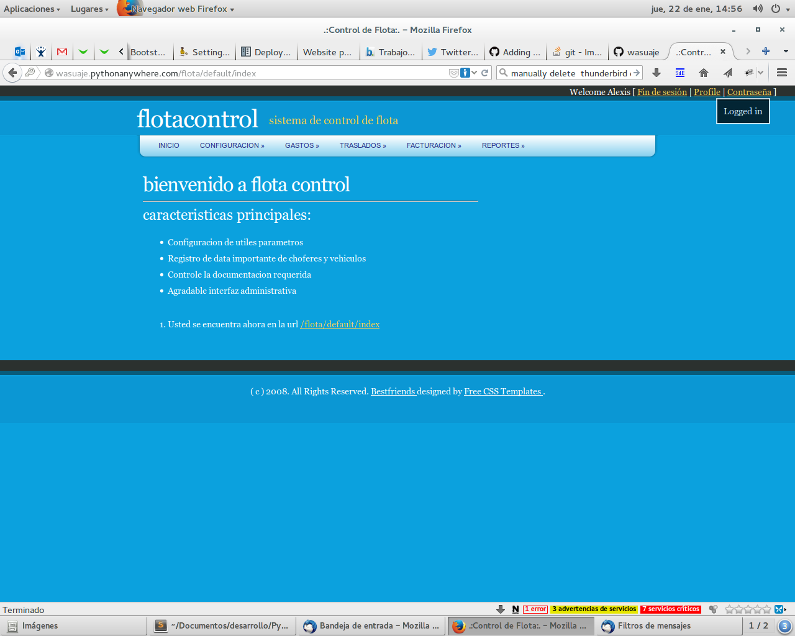
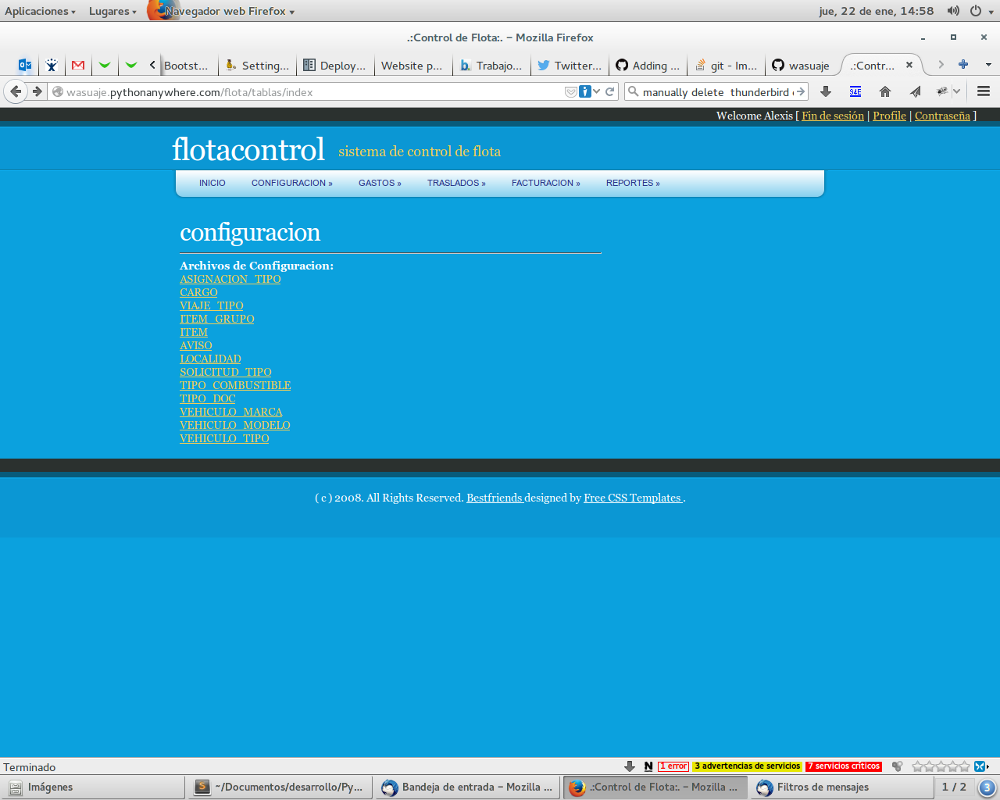
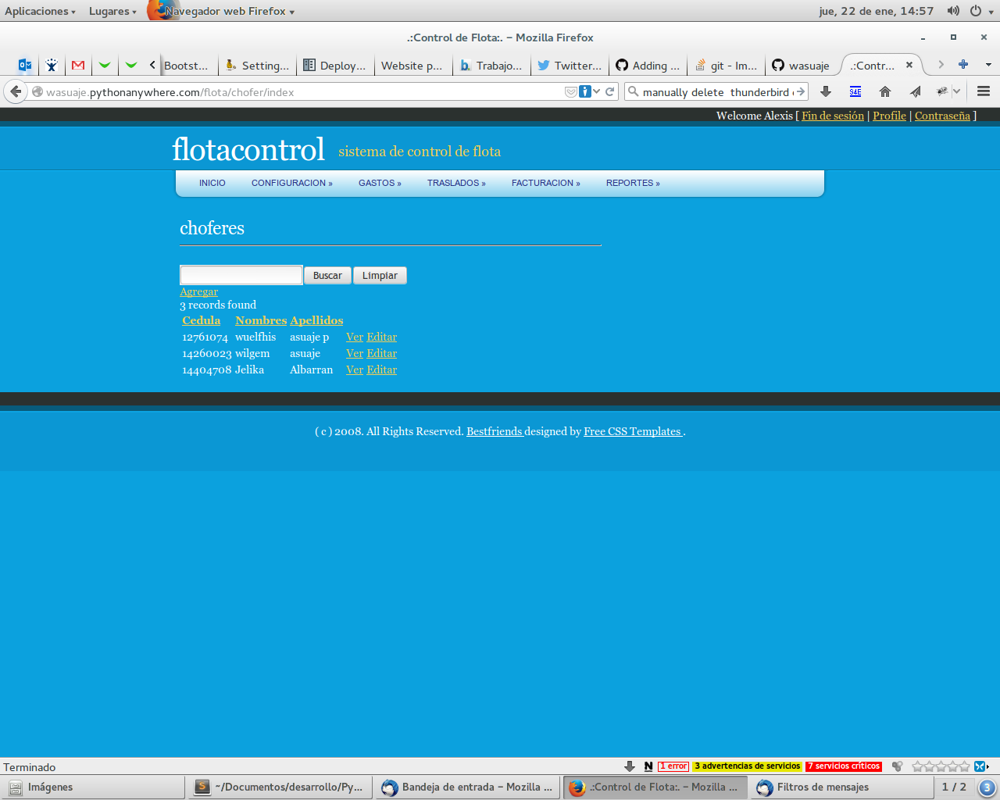
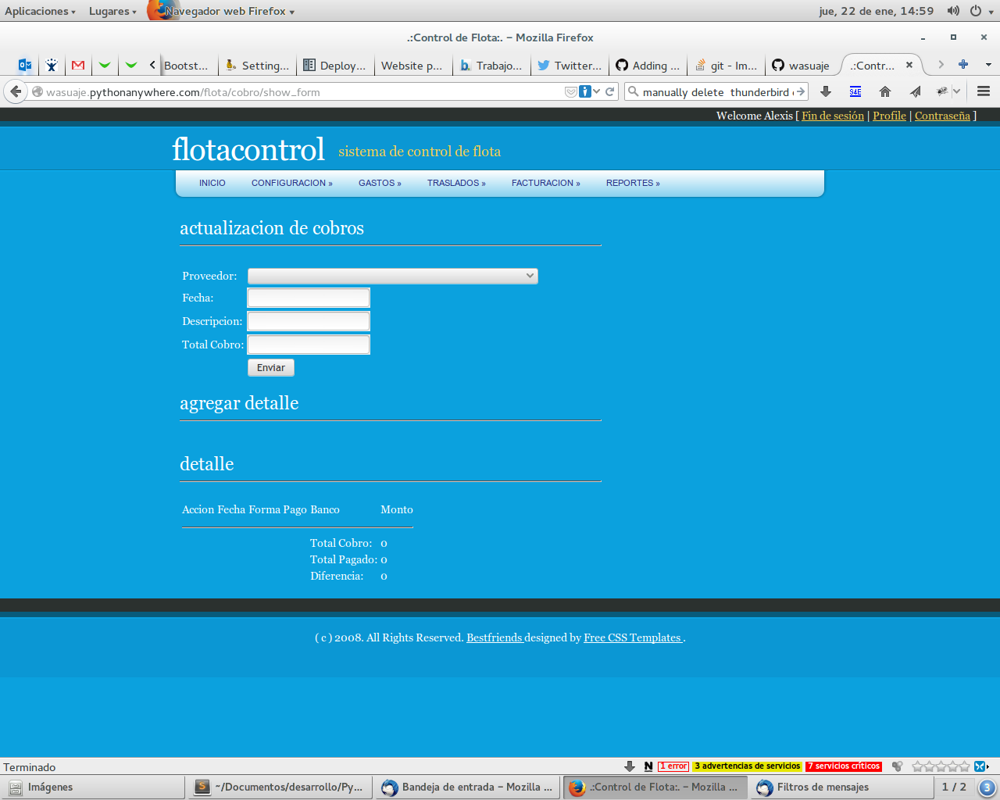
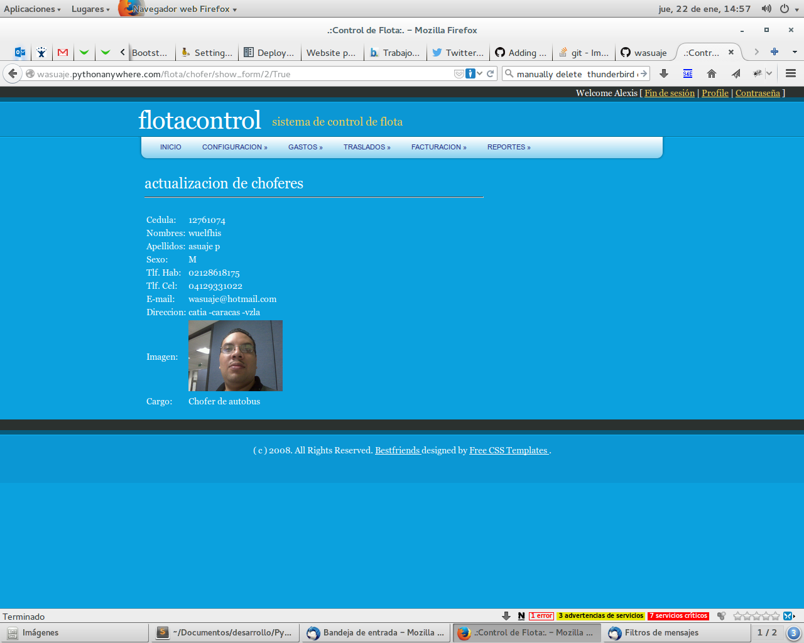
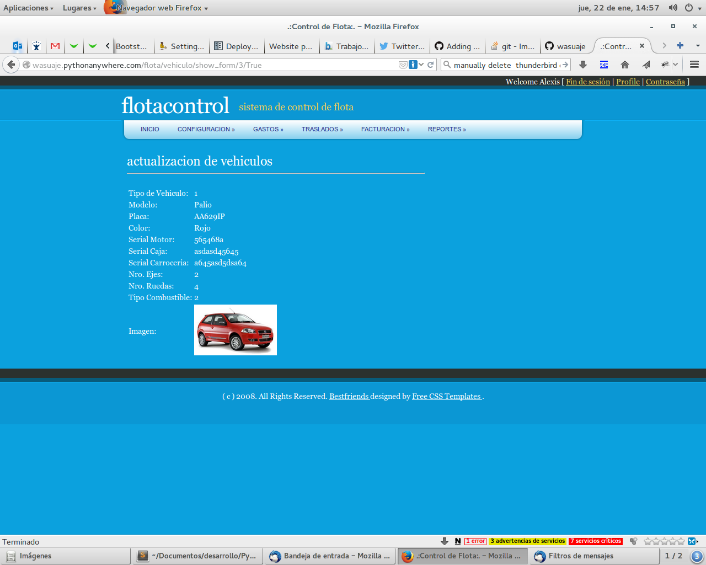
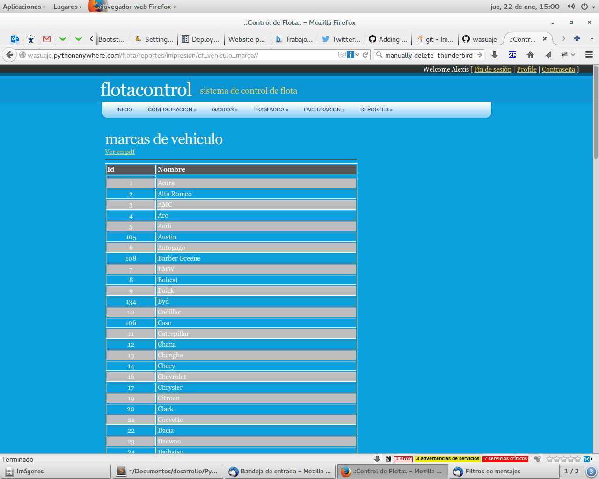

=======
Flotacontrol
=======

Es un proyecto WEB2py (Python) para el control de flota de vehiculos, sus gastos y viajes realizados,  Para verlo en funcionamiento pueden
ir a `Flota <http://http://wasuaje.pythonanywhere.com/flota>`_. No Necesita Registro

Requiere:
---------

::

 - Web2py instalado y funcionando.
 - La libreria FPDF.

Instalacion:
------------

- Descomprima o haga git clone el la carpeta application de su instalacion web2py

::

 git clone https://github.com/wasuaje/flotacontrol.git

Navegacion por el sistema:
-----------------

::

 Pantalla de logueo al sistema

::

 Pantalla de bienvenida

Configuracion:
-----------------

::

 Posee muchas opcione para configurar

Principales:
-----------------

::

 Todas las pantallas principales de cada item del menu es estilo lista, al seleccionar un puede 
 operar sobre el item requerido. Ademas se puede hacer busquedas.

Formularios:
-----------------

::

 Este es el estilo corriente de formularios de operacion.

Presentacion de los datos:
-----------------

::

 Los datos se muestran de esta manera

Presentacion de los datos:
-----------------

::

 Un reporte tipo

Ayuda:
-----------------

::

 Comunicate conmigo a wasuaje@hotmail.com si tienes duda o encuentras problemas para implementarlo.
